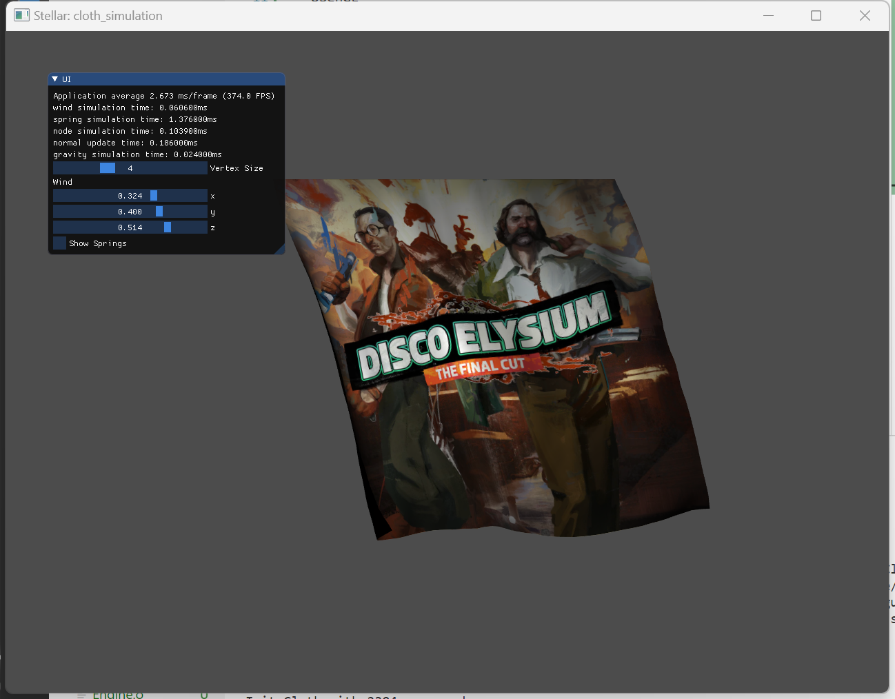
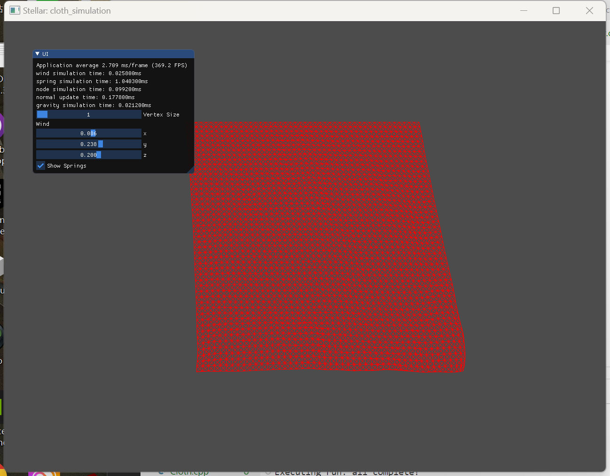

# cloth_simulation
A Demo about Cloth Simulation for CS Class

## 环境

* Windows 11
* c++17
* VS coded

## 使用第三方库

* OpenGL
* GLFW
* Glad
* glm
* Assimp
* stb_image

## 运行

在项目根目录下运行指令：

```[cmd]
make run
```

* 使用WSAD进行前后左右移动
* 左上角可调节风向/重力
* 可切换显示网格/材质

## 结果截图





## 目录结构

* include：存放所有依赖的头文件

* lib：第三方库的dll文件

* output：运行结果

* res：材质贴图与着色器文本

* src：项目代码

  * Core：核心组件（相机、着色器、缓冲）

  * imgui：UI相关头文件

* Makefile
* README.md